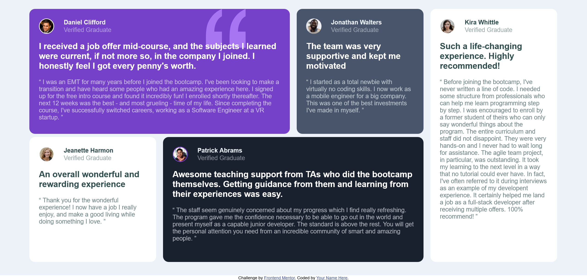

# Frontend Mentor - Testimonials grid section solution

This is a solution to the [Testimonials grid section challenge on Frontend Mentor](https://www.frontendmentor.io/challenges/testimonials-grid-section-Nnw6J7Un7). Frontend Mentor challenges help you improve your coding skills by building realistic projects. 

## Table of contents

- [Overview](#overview)
  - [The challenge](#the-challenge)
  - [Screenshot](#screenshot)
  - [Links](#links)
- [My process](#my-process)
  - [Built with](#built-with)
  - [What I learned](#what-i-learned)
  - [Continued development](#continued-development)
  - [Useful resources](#useful-resources)
- [Author](#author)
- [Acknowledgments](#acknowledgments)

## Overview

### The challenge

Users should be able to:

- View the optimal layout for the site depending on their device's screen size

### Screenshot


 - Screenshot of project

### Links

- Live Site URL: [Live Server URL](https://your-live-site-url.com)

## My process

### Built with

- Semantic HTML5 markup
- CSS custom properties
- Flexbox
- CSS Grid

### What I learned

I have learned how to make simple templates using HTML and CSS with help of flex properties and grid properties .

Observe below code for given project.

```html
<!DOCTYPE html>
<html lang="en">

<head>
    <meta charset="UTF-8">
    <meta name="viewport" content="width=device-width, initial-scale=1.0">
    <link rel="icon" type="image/png" sizes="32x32" href="./images/favicon-32x32.png">
    <link rel="stylesheet" href="style.css">
    <title>Frontend Mentor | [Challenge Name Here]</title>
</head>

<body>

    <div id="wrapper">
        <div class="grid">
            <div class="person person1" id="dc">
                <div class="top">
                    
                    <div class="data">
                        <div class="name">
                            <b>Daniel Clifford</b>
                        </div>
                        <div class="status">
                            <p>Verified Graduate</p>
                        </div>
                    </div>
                </div>
                <div class="content">
                    <div class="up">
                        <b>
                            I received a job offer mid-course, and the subjects I learned were current, if not more so,
                            in the company I joined. I honestly feel I got every penny's worth.
                        </b>
                    </div>
                    <div class="down">
                        <p>
                            “ I was an EMT for many years before I joined the bootcamp. I've been looking to make a
                            transition and have heard some people who had an amazing experience here. I signed up
                            for the free intro course and found it incredibly fun! I enrolled shortly thereafter.
                            The next 12 weeks was the best - and most grueling - time of my life. Since completing
                            the course, I've successfully switched careers, working as a Software Engineer at a VR
                            startup. ”
                        </p>
                    </div>
                </div>
            </div>

            <div class="person person2" id="jw">
                <div class="top">
                    
                    <div class="data">
                        <div class="name">
                            <b>Jonathan Walters</b>
                        </div>
                        <div class="status">
                            <p>Verified Graduate</p>
                        </div>
                    </div>
                </div>
                <div class="content">
                    <div class="up">
                        <b>
                            The team was very supportive and kept me motivated
                        </b>
                    </div>
                    <div class="down">
                        <p>
                            “ I started as a total newbie with virtually no coding skills. I now work as a mobile
                            engineer
                            for a big company. This was one of the best investments I've made in myself. ”
                        </p>
                    </div>
                </div>
            </div>

            <div class="person person3" id="kw">
                <div class="top">
                    
                    <div class="data">
                        <div class="name">
                            <b>Kira Whittle</b>
                        </div>
                        <div class="status">
                            <p>Verified Graduate</p>
                        </div>
                    </div>
                </div>
                <div class="content">
                    <div class="up">
                        <b>
                            Such a life-changing experience. Highly recommended!
                        </b>
                    </div>
                    <div class="down">
                        <p>
                            “ Before joining the bootcamp, I've never written a line of code. I needed some structure
                            from
                            professionals who can help me learn programming step by step. I was encouraged to enroll by
                            a former
                            student of theirs who can only say wonderful things about the program. The entire curriculum
                            and staff
                            did not disappoint. They were very hands-on and I never had to wait long for assistance. The
                            agile team
                            project, in particular, was outstanding. It took my learning to the next level in a way that
                            no tutorial
                            could ever have. In fact, I've often referred to it during interviews as an example of my
                            developent
                            experience. It certainly helped me land a job as a full-stack developer after receiving
                            multiple offers.
                            100% recommend! ”
                        </p>
                    </div>
                </div>
            </div>

            <div class="person person4" id="jh">
                <div class="top">
                    
                    <div class="data">
                        <div class="name">
                            <b>Jeanette Harmon</b>
                        </div>
                        <div class="status">
                            <p>Verified Graduate</p>
                        </div>
                    </div>
                </div>
                <div class="content">
                    <div class="up">
                        <b>
                            An overall wonderful and rewarding experience
                        </b>
                    </div>
                    <div class="down">
                        <p>
                            “ Thank you for the wonderful experience! I now have a job I really enjoy, and make a good
                            living
                            while doing something I love. ”
                        </p>
                    </div>
                </div>
            </div>

            <div class="person person5" id="pa">
                <div class="top">
                    
                    <div class="data">
                        <div class="name">
                            <b>Patrick Abrams</b>
                        </div>
                        <div class="status">
                            <p>Verified Graduate</p>
                        </div>
                    </div>
                </div>
                <div class="content">
                    <div class="up">
                        <b>
                            Awesome teaching support from TAs who did the bootcamp themselves. Getting guidance from
                            them and
                            learning from their experiences was easy.
                        </b>
                    </div>
                    <div class="down">
                        <p>
                            “ The staff seem genuinely concerned about my progress which I find really refreshing. The
                            program
                            gave me the confidence necessary to be able to go out in the world and present myself as a
                            capable
                            junior developer. The standard is above the rest. You will get the personal attention you
                            need from
                            an incredible community of smart and amazing people. ”
                        </p>
                    </div>
                </div>
            </div>
        </div>
    </div>

    <div class="attribution">
        Challenge by <a href="https://www.frontendmentor.io?ref=challenge" target="_blank">Frontend Mentor</a>.
        Coded by <a href="#">Your Name Here</a>.
    </div>
</body>

</html>
```
```css
@import url(https://fonts.google.com/specimen/Barlow+Semi+Condensed);

* {
    margin: 0;
    padding: 0;
    box-sizing: border-box;
    font-family: "Barlow Semi Condensed", sans-serif;
}

#wrapper {
    height: 100vh;
    width: 100%;
    overflow-x: hidden;
    display: flex;
    justify-content: center;
    align-items: center;
    background-color: hsl(210, 46%, 95%);
}

.grid {
    height: 90%;
    width: 90%;
    display: grid;
    grid-template-columns: 24% 24% 24% 24%;
    grid-template-rows: 49.5% 49.5%;
    grid-template-areas:
        "dc dc jw kw"
        "jh pa pa kw";
    gap: 1.3%;
}

#dc {
    grid-area: dc;
}

#jw {
    grid-area: jw;
}

#kw {
    grid-area: kw;
}

#jh {
    grid-area: jh;
}

#pa {
    grid-area: pa;
}

.person {
    padding-left: 25px;
    padding-bottom: 25px;
    padding-top: 25px;
    padding-right: 25px;
}

.person1 {
    border-radius: 15px;
    background-image: url(images/bg-pattern-quotation.svg);
    background-repeat: no-repeat;
    background-position-x: 80%;
    background-color: hsl(263, 55%, 52%);
}

.person2 {
    border-radius: 15px;
    background-color: hsl(217, 19%, 35%);
}

.person3 {
    border-radius: 15px;
    background-color: white;
}

.person4 {
    border-radius: 15px;
    background-color: white;
}

.person5 {
    border-radius: 15px;
    background-color: hsl(219, 29%, 14%);
}

.top {
    display: flex;
    align-items: center;
    padding-bottom: 20px;
}

.top img {
    width: 40px;
    height: 40px;
    border-radius: 50%;
    border: 2px solid white;
}

.data {
    padding-left: 25px;
    display: flex;
    flex-direction: column;
    justify-content: center;
    gap: 1px;
}

.name {
    color: hsl(210, 46%, 95%);
}

.status {
    color: hsla(210, 46%, 95%, 50%);
    font-size: medium;
}

.up {
    color: white;
    font-size: 22px;
}

.down {
    padding-top: 20px;
    font-size: 16px;
    color: hsla(210, 46%, 95%, 70%);
}

.person2 .top img {
    border: none;
}

.person3 .name {
    color: darkslategrey;
}

.person3 .status {
    color: darkslategrey;
    opacity: 50%;
}

.person3 .up {
    color: darkslategray;
}

.person3 .down {
    color: darkslategrey;
    opacity: 70%;
}

.person4 .name {
    color: darkslategrey;
}

.person4 .status {
    color: darkslategrey;
    opacity: 50%;
}

.person4 .up {
    color: darkslategrey;
}

.person4 .down {
    color: darkslategrey;
    opacity: 70%;
}

.person5 .top img {
    border: 2px solid;
    border-color: hsl(263, 55%, 52%);
}

.attribution {
    font-size: 11px;
    text-align: center;
}

.attribution a {
    color: hsl(228, 45%, 44%);
}


@media screen and (width<=526px) {
    #wrapper {
        display: flex;
        flex-direction: column;
        justify-content: center;
        align-items: center;
        min-width: 375px;
        height: 100%;
        padding-left: 15px;
        padding-right: 15px;
        padding-top: 100px;
        padding-bottom: 100px;
    }

    .grid {
        height: 90%;
        width: 90%;
        display: grid;
        grid-template-columns: 100%;
        grid-template-rows: 20% 20% 20% 20% 20%;
        grid-template-areas:
            "dc"
            "jw"
            "jh"
            "pa"
            "kw";
        gap: 1.3%;
    }

    #dc {
        grid-area: dc;
    }

    #jw {
        grid-area: jw;
    }

    #kw {
        grid-area: kw;
    }

    #jh {
        grid-area: jh;
    }

    #pa {
        grid-area: pa;
    }


    .person {
        border-radius: 15px;
        height: auto;
    }

    .attribution {
        text-align: center;
        font-size: 9px;
    }
}

@media screen and (width<=375px) {

    #wrapper {
        height: 100%;
        padding-left: 15px;
        padding-right: 15px;
        padding-top: 100px;
        padding-bottom: 100px;
    }

    .grid {
        height: 90%;
        width: 90%;
        display: grid;
        grid-template-columns: 100%;
        grid-template-rows: 20% 20% 20% 20% 20%;
        grid-template-areas:
            "dc"
            "jw"
            "jh"
            "pa"
            "kw";
        gap: 1.3%;
    }

    #dc {
        grid-area: dc;
    }

    #jw {
        grid-area: jw;
    }

    #kw {
        grid-area: kw;
    }

    #jh {
        grid-area: jh;
    }

    #pa {
        grid-area: pa;
    }


    .person {
        border-radius: 15px;
    }

    .attribution {
        text-align: center;
        font-size: 4px;
    }

}
```

### Continued development

I am trying to improve my skills in media queries.

### Useful resources

- [MDN Docs](https://developer.mozilla.org/en-US/) - Helped me in various learnings. 

## Author

- Website - [Prasanna Pandhare](https://www.your-site.com)
- Frontend Mentor - [@Prasannapandhare](https://www.frontendmentor.io/profile/Prasannapandhare)

## Acknowledgments

I understood the importance of CSS in designing HTML structure.
As well as understood about responsive websites.
